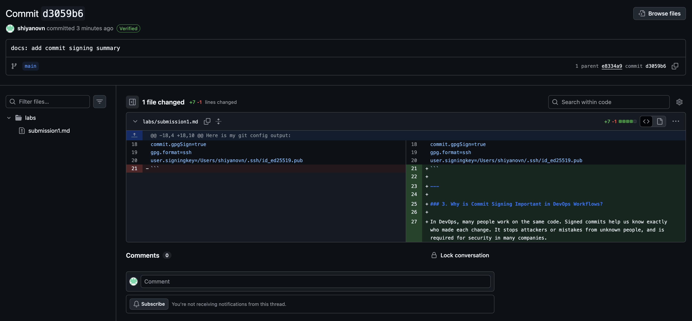
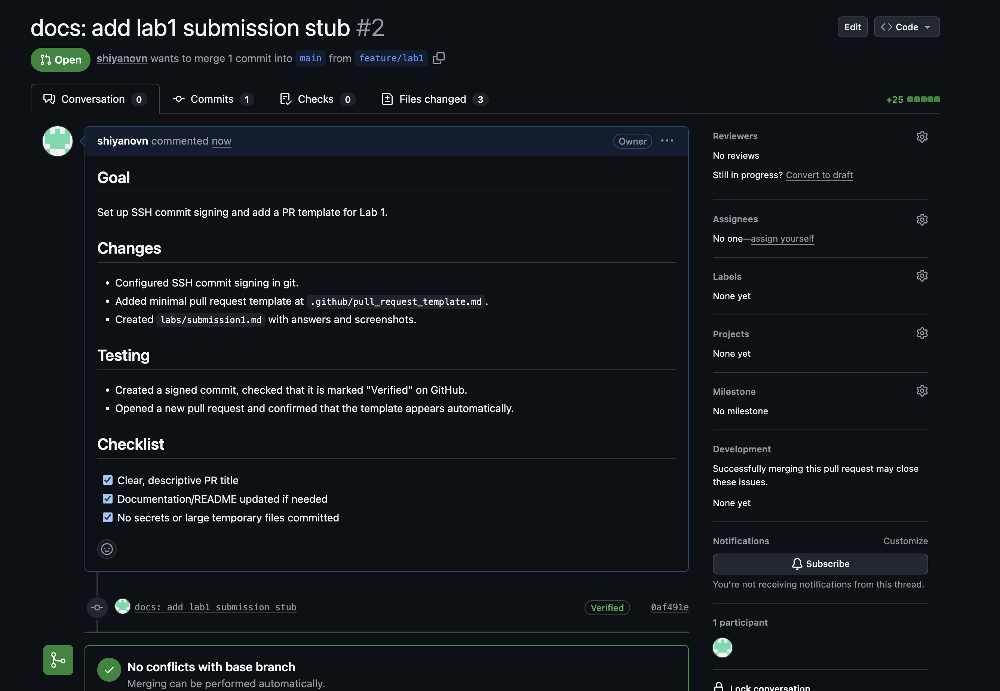

# Lab 1 — Commit Signing and PR Template

## Task 1: SSH Commit Signature Verification

### 1. Benefits of Signing Commits

Signing commits helps to prove that I made this commit. It protects my code from someone else trying to pretend to be me. Teams and companies can trust who wrote every piece of code.

---

### 2. Evidence of SSH Key Setup and Signed Commit

My SSH key is added to GitHub as a Signing Key. I also set up git to sign every commit with SSH.

Here is my git config output:

```
commit.gpgSign=true
gpg.format=ssh
user.signingkey=/Users/shiyanovn/.ssh/id_ed25519.pub
```

---

### 3. Why is Commit Signing Important in DevOps Workflows?

In DevOps, many people work on the same code. Signed commits help us know exactly who made each change. It stops attackers or mistakes from unknown people, and is required for security in many companies.


---

[My signed commit](https://github.com/shiyanovn/DevOps-Intro/commit/d3059b65be7140413647905435e988f4705540a0)


---

## Task 2: PR Template & Checklist

### 1. PR Template Location

File `.github/pull_request_template.md` is created in the main branch.

### 2. Screenshot of PR Template Auto-fill



### 3. How PR Templates Help

PR templates help teams to remember all important information for every pull request. It makes review easier and reduces mistakes.

### 4. Challenges

At first, the template did not appear because I created PR before adding the file to main. I learned the template must be in main before PR.
