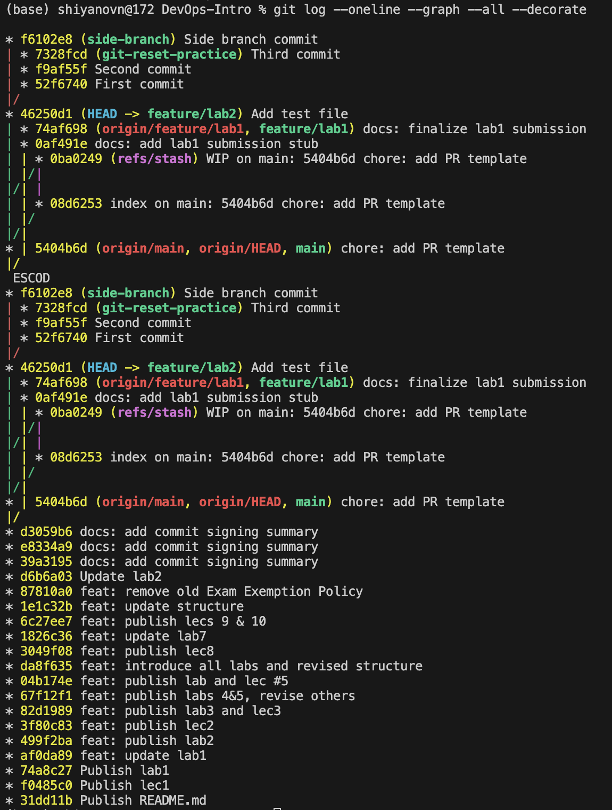

# Lab 2 — Task 1: Git Object Model Exploration

## 1.1 Create Sample Commits

Commands used:
```bash
echo "Test content" > test.txt
git add test.txt
git commit -m "Add test file"
```

Latest commit:
```bash
git log --oneline -1
```

Output:
```bash
46250d1 (HEAD -> feature/lab2) Add test file
```

## 1.2 Inspect Git Objects

### Commit object
Command:
```bash
git cat-file -p HEAD
```

Output:
```bash
tree bf94c0360c5d665543018ff9ad4057ebd475131c
parent 5404b6d354eac365b13077a31312866e64f2204e
author Nikita Shiianov <nekit.shina@gmail.com> 1770918213 +0300
committer Nikita Shiianov <nekit.shina@gmail.com> 1770918213 +0300
gpgsig -----BEGIN SSH SIGNATURE-----
 U1NIU0lHAAAAAQAAADMAAAALc3NoLWVkMjU1MTkAAAAgLQqGGAiaiiDo8kREjIIxosYq2X
 ZdPiBz1SiJCdwy1rQAAAADZ2l0AAAAAAAAAAZzaGE1MTIAAABTAAAAC3NzaC1lZDI1NTE5
 AAAAQEn1WLCGa+sMWqZiuqgm9500PQuFuhAdvAOw1hCvlurLX14DCCacdBuKz9pJ91hAZn
 1c7rpcrJ42D7W0EbeumgE=
 -----END SSH SIGNATURE-----

Add test file
```
A commit stores project metadata (author/committer, message, timestamp) and pointers to other objects. The snapshot via the tree hash and the previous commit via the parent hash

### Tree object
Command:
```bash
git cat-file -p bf94c0360c5d665543018ff9ad4057ebd475131c
```

Output:
```bash
040000 tree 43a27e6cbde3d7c596b05a7baf460ed7374b68dd    .github
100644 blob 6e60bebec0724892a7c82c52183d0a7b467cb6bb    README.md
040000 tree a1061247fd38ef2a568735939f86af7b1000f83c    app
040000 tree 0b406e273dc915067842a01d05376a7f6c7d0a79    labs
040000 tree d3fb3722b7a867a83efde73c57c49b5ab3e62c63    lectures
100644 blob 2eec599a1130d2ff231309bb776d1989b97c6ab2    test.txt
```
A tree represents a directory listing: it maps names to object hashes and file modes. Trees reference blobs and other trees.

### Blob object
Command:
```bash
git cat-file -p 2eec599a1130d2ff231309bb776d1989b97c6ab2
```

Output:
```bash
Test content
```

A blob stores the raw contents of a file only. The filename and directory structure are stored in tree objects.

## How Git stores repository data
Git stores repository data as a set of content-addressed objects (hash → content).
File contents are stored as blobs, directory structure is stored as trees (which reference blobs/trees), and commits reference a root tree plus metadata and parent commits, forming the full history graph.

# Task 2 — Reset and Reflog Recovery

## 2.1 Create Practice Branch

Commands run:
```bash
git switch -c git-reset-practice
echo "First commit" > file.txt && git add file.txt && git commit -m "First commit"
echo "Second commit" >> file.txt && git add file.txt && git commit -m "Second commit"
echo "Third commit"  >> file.txt && git add file.txt && git commit -m "Third commit"
```
I created an isolated branch (git-reset-practice) to safely experiment with git reset modes without affecting other branches.

### History after creating 3 commits
```bash
7328fcd (HEAD -> git-reset-practice) Third commit
f9af55f Second commit
52f6740 First commit
46250d1 (feature/lab2) Add test file
5404b6d (origin/main, origin/HEAD, main) chore: add PR template
```

Working tree file content
```
First commit
Second commit
Third commit
```

### 2.2 Explore Reset Modes

### Command run:

```bash
git reset --soft HEAD~1
```
--soft moves HEAD to an earlier commit but keeps changes from the removed commit in the index. Useful when you want to redo/amend the last commit while keeping changes staged.

### History after soft reset (git log --oneline --decorate -5):

```bash
f9af55f (HEAD -> git-reset-practice) Second commit
52f6740 First commit
46250d1 (feature/lab2) Add test file
5404b6d (origin/main, origin/HEAD, main) chore: add PR template
d3059b6 docs: add commit signing summary
```

### Status after soft reset (git status -sb):
```bash
## git-reset-practice
M  file.txt
?? labs/submission2.md
```

### Staged diff after soft reset (git diff --cached):
```bash
diff --git a/file.txt b/file.txt
index 6a3adff..5b3c010 100644
--- a/file.txt
+++ b/file.txt
@@ -1,2 +1,3 @@
 First commit
 Second commit
+Third commit
```

History (HEAD): moved from 7328fcd (Third commit) back to f9af55f (Second commit). The Third commit disappeared from git log.
Index: kept the changes from Third commit staged (git diff --cached shows +Third commit).
Working tree: the file still contained “Third commit” (no content loss).

### Command run:

```bash
git reset --hard HEAD~1
```

--hard moves HEAD and also resets both the index and working tree to match the target commit, discarding staged and unstaged changes.

### Output + history after hard reset (git log --oneline --decorate -5):

```bash
HEAD is now at 52f6740 First commit
52f6740 (HEAD -> git-reset-practice) First commit
46250d1 (feature/lab2) Add test file
5404b6d (origin/main, origin/HEAD, main) chore: add PR template
d3059b6 docs: add commit signing summary
e8334a9 docs: add commit signing summary
```

### Status after hard reset (git status -sb):
```bash
## git-reset-practice
?? labs/submission2.md
```

### Working tree file content after hard reset (cat file.txt):
```bash
First commit
```

History (HEAD): moved from f9af55f (Second commit) back to 52f6740 (First commit).
Index: staged changes were discarded (no staged modification for file.txt remains).
Working tree: file.txt was reverted to the content of the First commit (Second/Third lines removed).

## Recovery using git reflog

### Command run:
```bash
git reflog -10
```
### Reflog snippet:
```bash
52f6740 (HEAD -> git-reset-practice) HEAD@{0}: reset: moving to HEAD~1
f9af55f HEAD@{1}: reset: moving to HEAD~1
7328fcd HEAD@{2}: commit: Third commit
f9af55f HEAD@{3}: commit: Second commit
52f6740 (HEAD -> git-reset-practice) HEAD@{4}: commit: First commit
46250d1 (feature/lab2) HEAD@{5}: checkout: moving from feature/lab2 to git-reset-practice
```

### Recovery command:
```bash 
git reset --hard 7328fcd
```

### History after recovery (git log --oneline --decorate -5):
```bash
7328fcd (HEAD -> git-reset-practice) Third commit
f9af55f Second commit
52f6740 First commit
46250d1 (feature/lab2) Add test file
5404b6d (origin/main, origin/HEAD, main) chore: add PR template
```

### Working tree file content after recovery (cat file.txt):
```
First commit
Second commit
Third commit
```
Even after git reset --hard removed commits from the visible branch history, git reflog still recorded previous HEAD positions (including commit 7328fcd). By resetting back to that hash, I restored both the branch pointer and the working tree/index state to the “Third commit” snapshot.

# Task 3 — Visualize Commit History

## Commands run
```bash
git switch feature/lab2
git switch -c side-branch
echo "Branch commit" >> history.txt
git add history.txt
git commit -m "Side branch commit"
git switch -
git log --oneline --graph --all --decorate
```

## Graph screenshot


## Graph snippet (text)
```text
* f6102e8 (side-branch) Side branch commit
| * 7328fcd (git-reset-practice) Third commit
| * f9af55f Second commit
| * 52f6740 First commit
|/
* 46250d1 (HEAD -> feature/lab2) Add test file
* 5404b6d (origin/main, origin/HEAD, main) chore: add PR template
```

## Commit messages list
- Side branch commit
- Third commit
- Second commit
- First commit
- Add test file
- chore: add PR template

### Reflection
The graph view makes it clear where branches diverged and which commit each branch pointer refers to. This helps understand parallel work and the overall structure of the repository history.

# Task 4 — Tagging Commits

## Commands used
```bash
git tag v1.0.0
git rev-parse v1.0.0
git push origin v1.0.0

echo "Release 1.1.0" >> history.txt
git add history.txt
git commit -m "Prepare v1.1.0"
git tag v1.1.0
git push origin v1.1.0
```

## Tag → commit hash
- `v1.0.0` → `46250d17710673fb01bf0a8ba9b05d96cb49c7f3` (commit: “Add test file”)
- `v1.1.0` → `1f8bc48dd42f947bbdfbe92650a03b239df273b0` (commit: “Prepare v1.1.0”)

## Why tags matter
Tags provide stable, human-readable names for specific commits. They are used for versioning, generating release notes, and often to trigger CI/CD pipelines or deployments for an exact release commit.

# Task 5 — git switch vs git checkout vs git restore

## Option A: git switch (branches only)

Commands run:
```bash
git branch --show-current
git switch -c cmd-compare
git branch --show-current
git status -sb
git switch -
git branch --show-current
```
### Outputs:
```bash
feature/lab2
Switched to a new branch 'cmd-compare'
cmd-compare
## cmd-compare
?? labs/screenshots/
?? labs/submission2.md
Switched to branch 'feature/lab2'
feature/lab2
```
### git restore (file operations):
#### Commands run:
```bash
echo "temp line" >> test.txt
git status -sb
git restore test.txt
git status -sb
```

### Outputs:

```bash
## feature/lab2
 M test.txt
?? labs/screenshots/
?? labs/submission2.md

## feature/lab2
?? labs/screenshots/
?? labs/submission2.md
```

## When to use which 

`git switch` to create and switch branches because it is focused only on branch navigation and is clearer than git checkout. `git restore` to discard changes in the working tree (or unstage changes with --staged) without changing commit history. git checkout is a legacy command that mixes branch switching and file restore behavior, which can be confusing compared to the modern split commands.

# Task 6 — GitHub Community

Starring repositories is a lightweight way to bookmark useful projects and to signal community interest, which can increase a project’s visibility and motivate maintainers. Following developers (professor, TAs, and classmates) helps me stay updated on their work, discover relevant tools and practices, and makes collaboration easier in team projects and professional networking.
